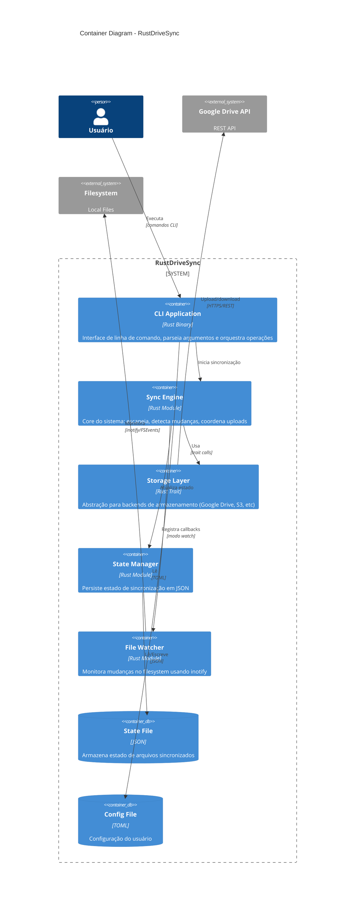

# C4 Model - Level 2: Container Diagram

## Overview
Visão dos principais containers (aplicações/processos) que compõem o RustDriveSync e como se comunicam.

## Diagram



## Descrição dos Containers

### CLI Application
- **Tecnologia**: Rust Binary (executável compilado)
- **Responsabilidades**:
  - Parsear argumentos de linha de comando
  - Validar e carregar configuração
  - Inicializar logging
  - Orquestrar fluxo de sincronização
  - Exibir progresso e erros
- **Entradas**: Argumentos CLI, config.toml
- **Saídas**: Logs (stdout/file), exit codes
- **Dependências**: clap, tracing

**Comandos Principais**:
```bash
rustdrivesync sync        # Sincronização única
rustdrivesync watch       # Monitoramento contínuo
rustdrivesync status      # Status da sincronização
rustdrivesync config      # Gerenciar configuração
```

### Sync Engine
- **Tecnologia**: Rust Module (biblioteca interna)
- **Responsabilidades**:
  - Escanear diretório local recursivamente
  - Detectar mudanças (novos, modificados, deletados)
  - Coordenar uploads paralelos
  - Aplicar retry com backoff
  - Gerenciar semaphore de concorrência
  - Agregar estatísticas
- **Arquitetura**: Generic sobre `StorageBackend`
- **Thread Model**: Async (Tokio), multi-task
- **Principais Structs**:
  - `SyncEngine<S: StorageBackend>`
  - `FileScanner`
  - `ChangeTracker`
  - `SyncStats`

**Fluxo de Sincronização**:
1. Escanear filesystem
2. Comparar com estado anterior
3. Gerar lista de mudanças
4. Processar uploads em paralelo
5. Atualizar estado
6. Retornar estatísticas

### Storage Layer
- **Tecnologia**: Rust Trait (abstração)
- **Responsabilidades**:
  - Definir contrato para backends
  - Implementar Google Drive backend
  - Aplicar rate limiting
  - Converter entre tipos internos e API
- **Implementações**:
  - `DriveStorageBackend` (produção)
  - `MockStorage` (testes)
  - Futuro: `S3Backend`, `DropboxBackend`

**Interface (trait)**:
```rust
#[async_trait]
pub trait StorageBackend: Send + Sync {
    async fn upload_file(&self, ...) -> Result<UploadResult>;
    async fn ensure_folder(&self, ...) -> Result<FolderInfo>;
    async fn list_files(&self, ...) -> Result<Vec<FileInfo>>;
    // ...
}
```

### State Manager
- **Tecnologia**: Rust Module
- **Responsabilidades**:
  - Persistir estado de arquivos sincronizados
  - Rastrear MD5, modified time, file_id
  - Salvar estado periodicamente
  - Recuperar de estado corrompido
  - Limpar entradas antigas
- **Formato de Dados**: JSON
- **Thread Safety**: Protegido por Mutex
- **Principais Structs**:
  - `SyncStateManager`
  - `FileState`
  - `SyncState`

**Estrutura do State**:
```json
{
  "local_root": "/home/user/docs",
  "remote_root": "folder_id_123",
  "last_full_sync": 1704629400,
  "files": {
    "doc.pdf": {
      "drive_id": "file_xyz",
      "md5_hash": "abc123",
      "size": 1024,
      "modified_time": 1704629300,
      "last_synced": 1704629400
    }
  }
}
```

### File Watcher
- **Tecnologia**: Rust Module (notify crate)
- **Responsabilidades**:
  - Monitorar diretório para mudanças
  - Debounce de eventos (evitar spam)
  - Filtrar eventos irrelevantes
  - Notificar Sync Engine de mudanças
- **Backends**:
  - Linux: inotify
  - macOS: FSEvents
  - Windows: ReadDirectoryChangesW
- **Principais Structs**:
  - `FileWatcher`
  - `WatcherConfig`
  - `FileEvent`

**Eventos Capturados**:
- Create: Novo arquivo
- Modify: Arquivo modificado
- Delete: Arquivo removido
- Rename: Arquivo renomeado

### State File (Database)
- **Tipo**: JSON File
- **Localização**: `~/.config/rustdrivesync/state.json`
- **Tamanho Típico**: 10KB - 10MB (depende de número de arquivos)
- **Backup**: Automático (.bak) antes de sobrescrever
- **Formato**: JSON legível (pretty-printed)

### Config File
- **Tipo**: TOML File
- **Localização**: `~/.config/rustdrivesync/config.toml` ou especificado via `--config`
- **Validação**: Em tempo de inicialização
- **Exemplo**:
```toml
[general]
log_level = "info"

[source]
path = "/home/user/documents"
recursive = true

[google_drive]
credentials_file = "credentials.json"
target_folder_name = "MyBackup"

[sync]
mode = "watch"
max_concurrent_uploads = 2
```

## Comunicação Entre Containers

### CLI → Sync Engine
- **Padrão**: Chamada de função direta
- **Dados**: Config struct, SyncMode enum
- **Retorno**: SyncResult com estatísticas

### Sync Engine → Storage Layer
- **Padrão**: Trait method calls (async)
- **Dados**: UploadOptions, file paths
- **Retorno**: UploadResult, FolderInfo, etc.

### Sync Engine ↔ State Manager
- **Padrão**: Mutex-protected shared state
- **Thread Safety**: Arc<Mutex<SyncStateManager>>
- **Operações**: Read state, update state, save state

### Storage Layer → Google Drive API
- **Protocolo**: HTTPS/REST
- **Autenticação**: Bearer token (OAuth 2.0)
- **Rate Limiting**: 10 concurrent, 800 req/100s
- **Retry**: Exponential backoff (3 tentativas)

### File Watcher → Filesystem
- **Mecanismo**: inotify (Linux), FSEvents (macOS)
- **Eventos**: IN_CREATE, IN_MODIFY, IN_DELETE, IN_MOVED_*
- **Debounce**: 1 segundo (configurável)

## Deployment

### Processo Único
RustDriveSync é uma **aplicação single-process**:
- Todo código roda em um único processo do OS
- Múltiplas threads gerenciadas pelo Tokio
- Não há comunicação inter-processo

### Threads e Tasks
- **Main Thread**: CLI parsing, inicialização
- **Tokio Runtime**: Executor assíncrono
  - Worker Threads: N (padrão: num_cpus)
  - Tasks: Centenas (leves, gerenciadas pelo runtime)
- **Upload Tasks**: Até `max_concurrent_uploads` simultâneas

### Recursos de Sistema
| Recurso | Uso Típico | Pico |
|---------|------------|------|
| CPU | 5-15% | 50% (cálculo MD5) |
| RAM | 10-50 MB | 200 MB (muitos arquivos) |
| Network | Variável | Upload bandwidth |
| Disk I/O | Leitura de arquivos | Alta durante scan |

## Escalabilidade

### Limites Atuais
- **Arquivos**: Testado até 10.000 arquivos
- **Tamanho de Arquivo**: 5 TB (limite do Google Drive)
- **Concorrência**: 10 uploads simultâneos (configurável)

### Gargalos Potenciais
1. **State File I/O**: Salvar estado com muitos arquivos pode ser lento
   - Mitigação: Save interval configurável
2. **Mutex Contention**: Alto paralelismo pode causar contenção
   - Mitigação: Minimizar tempo sob lock
3. **Google Drive Rate Limit**: 1.000 req/100s
   - Mitigação: Rate limiter conservador

## Resiliência

### Falha de Componentes
| Componente | Impacto | Recuperação |
|------------|---------|-------------|
| Sync Engine crash | Sincronização para | Restart + resume from state |
| State File corrupto | Perde histórico | Fallback para full sync |
| Config inválido | Não inicia | Erro descritivo, exit |
| Google Drive down | Uploads falham | Retry automático |
| Network perda | Request timeout | Retry com backoff |

### Graceful Shutdown
- SIGINT/SIGTERM: Salva estado antes de sair
- Uploads em progresso: Completam ou timeout
- File watcher: Unregister callbacks

## Observabilidade

### Logging
- **Framework**: tracing (Rust)
- **Níveis**: ERROR, WARN, INFO, DEBUG, TRACE
- **Destinos**: stdout, file (configurável)
- **Formato**: Text ou JSON

### Métricas (Futuro)
- Total files synced
- Upload success rate
- Average upload time
- Retry count
- Rate limit hits

### Tracing (Futuro)
- Distributed tracing com spans
- Correlação de requests
- Performance profiling
