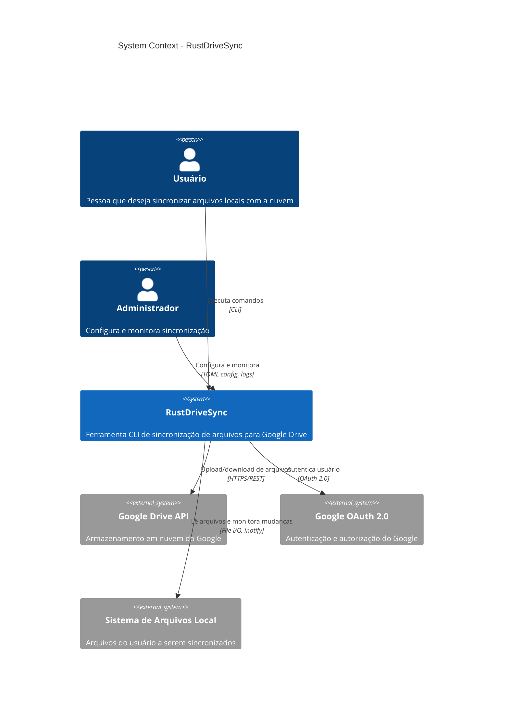

# C4 Model - Level 1: System Context Diagram

## Overview
Visão de alto nível do RustDriveSync e suas interações com sistemas externos e usuários.

## Diagram



## Descrição dos Elementos

### Usuários

#### Usuário
- **Tipo**: Pessoa
- **Responsabilidade**: Executar comandos para sincronizar arquivos
- **Interação**: CLI (command-line interface)
- **Casos de Uso**:
  - Sincronizar diretório local com Google Drive
  - Monitorar mudanças contínuas
  - Verificar status de sincronização

#### Administrador
- **Tipo**: Pessoa
- **Responsabilidade**: Configurar sistema e monitorar operação
- **Interação**: Arquivos TOML, logs, métricas
- **Casos de Uso**:
  - Configurar credenciais do Google
  - Ajustar parâmetros de retry e rate limiting
  - Analisar logs de falhas

### Sistema Principal

#### RustDriveSync
- **Tipo**: Sistema de Software
- **Descrição**: Ferramenta de linha de comando escrita em Rust para sincronizar arquivos locais com Google Drive
- **Responsabilidades**:
  - Escanear sistema de arquivos local
  - Detectar mudanças em arquivos
  - Fazer upload/download de arquivos
  - Gerenciar estado de sincronização
  - Implementar retry com backoff
  - Aplicar rate limiting
  - Gerar logs estruturados
- **Tecnologias**: Rust, Tokio, Reqwest, Serde

### Sistemas Externos

#### Google Drive API
- **Tipo**: Sistema Externo
- **Descrição**: API REST do Google para armazenamento em nuvem
- **Interação**: HTTPS/REST
- **Endpoints Usados**:
  - `/upload/drive/v3/files` - Upload de arquivos
  - `/drive/v3/files` - Listagem e metadados
  - `/drive/v3/files/{fileId}` - Operações em arquivos específicos
- **Limites**:
  - 1.000 requests/100s por usuário
  - 10.000 requests/100s por projeto

#### Google OAuth 2.0
- **Tipo**: Sistema Externo
- **Descrição**: Serviço de autenticação e autorização do Google
- **Interação**: OAuth 2.0 flow
- **Fluxo**:
  1. RustDriveSync solicita autorização
  2. Usuário aprova no browser
  3. Google retorna tokens (access + refresh)
  4. Tokens armazenados localmente
- **Scopes Requeridos**:
  - `https://www.googleapis.com/auth/drive.file`

#### Sistema de Arquivos Local
- **Tipo**: Sistema Externo
- **Descrição**: Arquivos e diretórios do usuário
- **Interação**: File I/O, inotify/FSEvents
- **Operações**:
  - Leitura recursiva de diretórios
  - Leitura de conteúdo de arquivos
  - Monitoramento de mudanças (watch mode)
  - Cálculo de MD5 checksums

## Cenários de Uso

### Cenário 1: Primeira Sincronização
1. Usuário executa `rustdrivesync sync`
2. Sistema solicita autenticação OAuth
3. Usuário aprova no browser
4. Sistema escaneia diretório local
5. Sistema faz upload de todos os arquivos para Google Drive
6. Estado de sincronização é salvo

### Cenário 2: Sincronização Contínua
1. Usuário executa `rustdrivesync watch`
2. Sistema inicia monitoramento do filesystem
3. Detecta mudança em arquivo
4. Faz upload da mudança para Google Drive
5. Atualiza estado
6. Continua monitorando

### Cenário 3: Retry em Falha de Rede
1. Durante upload, ocorre timeout de rede
2. Sistema detecta erro retryable
3. Aguarda backoff exponencial (1s, 2s, 4s...)
4. Retenta operação
5. Sucesso ou falha após max_attempts

## Fronteiras do Sistema

### O que está DENTRO do escopo
- ✅ Sincronização local → Google Drive
- ✅ Detecção de mudanças
- ✅ Upload paralelo
- ✅ Retry automático
- ✅ Rate limiting
- ✅ Gerenciamento de estado

### O que está FORA do escopo
- ❌ Sincronização bidirecional (Drive → Local)
- ❌ Interface gráfica (GUI)
- ❌ Sincronização em tempo real (<1s de latência)
- ❌ Resolução automática de conflitos
- ❌ Compartilhamento e permissões do Drive
- ❌ Outros backends (S3, Dropbox) - planejado para futuro

## Dependências Externas Críticas

| Sistema | Criticidade | Impacto de Falha | SLA Esperado |
|---------|-------------|------------------|--------------|
| Google Drive API | CRÍTICA | Sistema não funciona | 99.9% |
| Google OAuth 2.0 | CRÍTICA | Não autentica | 99.9% |
| Sistema de Arquivos | CRÍTICA | Não lê arquivos | N/A (local) |
| Internet | CRÍTICA | Não conecta | N/A (ISP) |

## Fluxos de Dados Principais

### Upload de Arquivo
```
Filesystem → RustDriveSync → Rate Limiter → Retry Logic → Google Drive API
                ↓
          State Manager (salva progresso)
```

### Monitoramento de Mudanças
```
Filesystem Events → File Watcher → Change Tracker → Sync Engine → Upload
```

### Autenticação
```
User → RustDriveSync → Google OAuth → Browser → User Approval → Tokens → Local Storage
```

## Considerações de Segurança

### Dados Sensíveis
- **Tokens OAuth**: Armazenados em `~/.config/rustdrivesync/token.json`
  - Permissão: 600 (apenas owner)
  - Criptografia: Não (confia no filesystem)
- **Credenciais**: Em `credentials.json`
  - Deve ser protegido pelo usuário

### Comunicação
- **HTTPS**: Todas as comunicações com Google usam TLS 1.2+
- **Certificados**: Validação automática via Reqwest

### Princípio do Menor Privilégio
- Apenas scope `drive.file` (arquivos criados pela app)
- Não solicita acesso a todo o Drive do usuário
