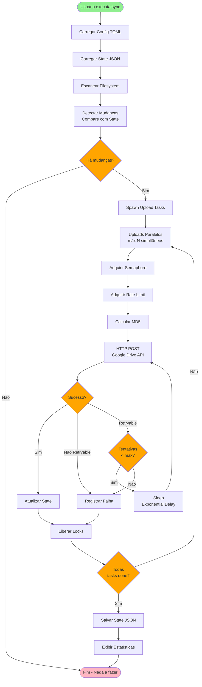
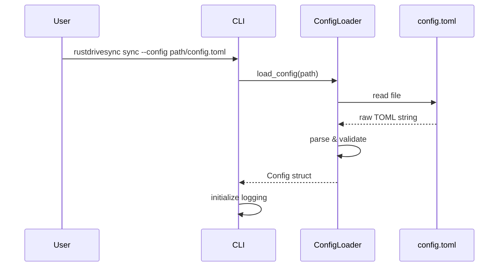
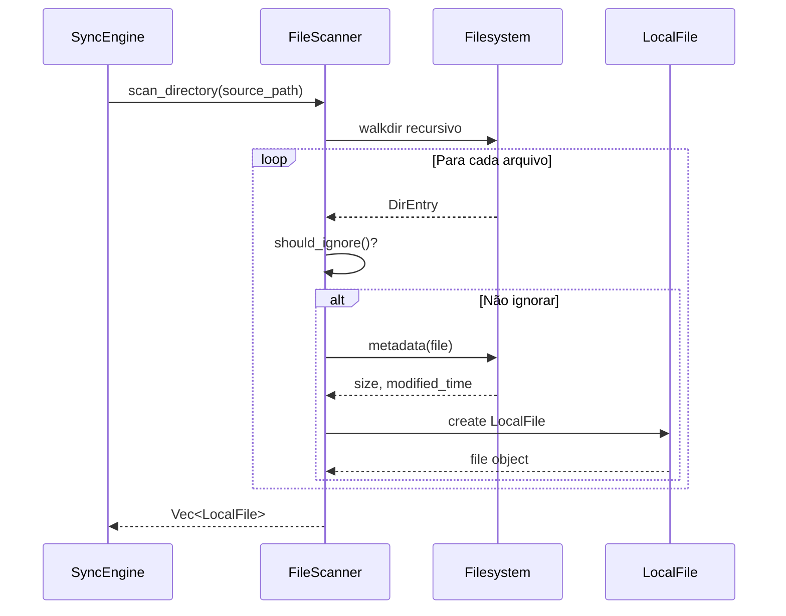
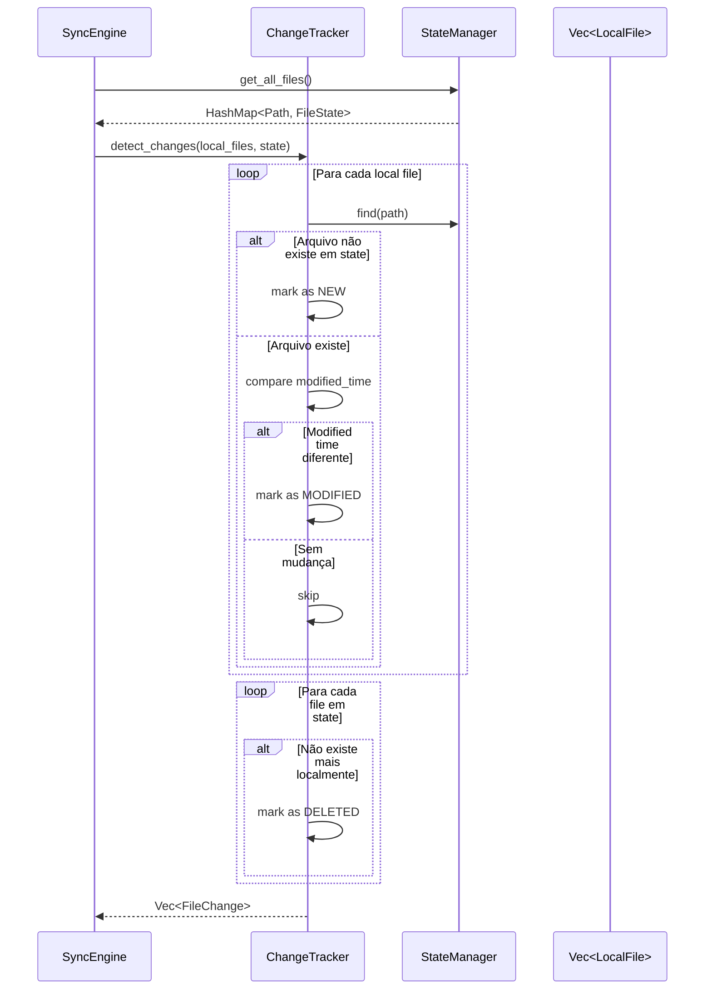
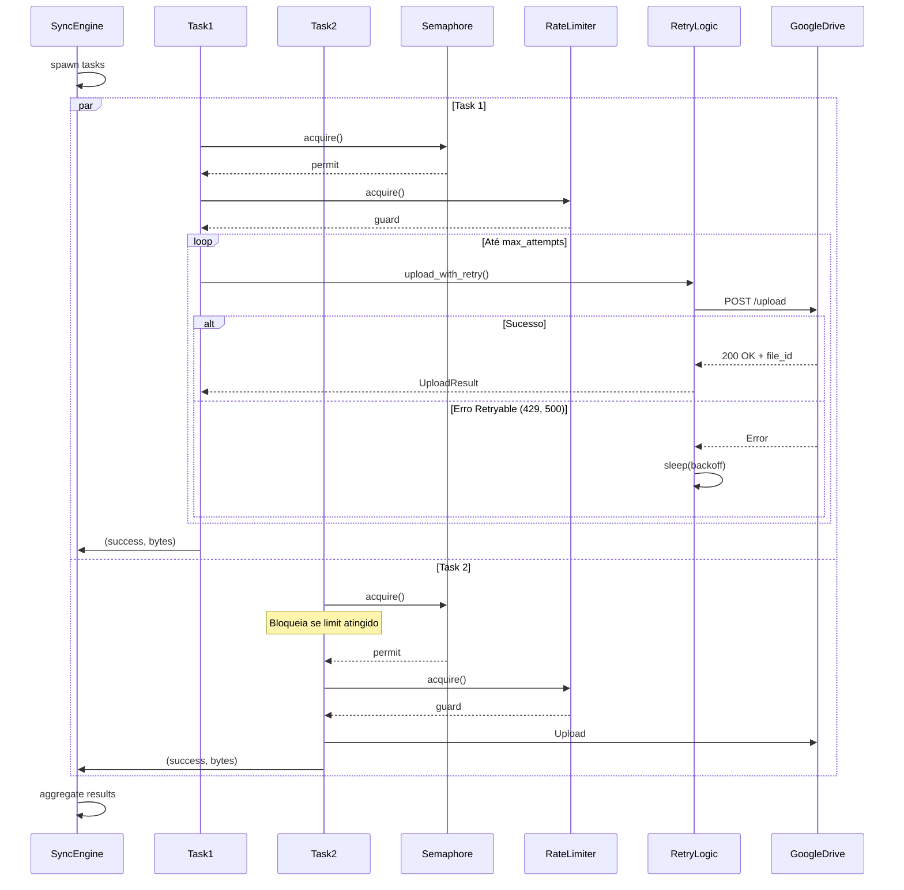
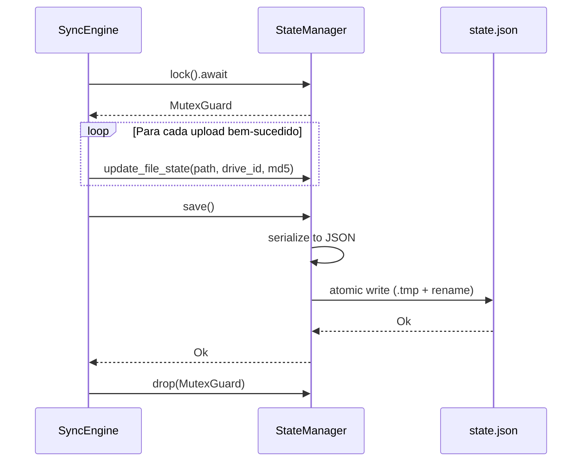
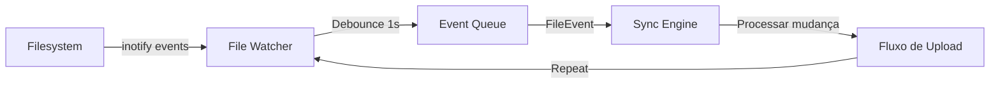

# Data Flow Diagram - RustDriveSync

## Overview
Visualização do fluxo de dados através dos componentes do sistema durante operações principais.

## Fluxo Principal: Sincronização de Arquivo



## Fluxo de Dados por Componente

### 1. Carregamento de Configuração



**Dados Trafegados**:
- Input: Caminho do arquivo config
- Output: `Config` struct validada
- Validações:
  - Campos obrigatórios presentes
  - Valores em ranges válidos
  - Paths existem

### 2. Escaneamento de Filesystem



**Dados Trafegados**:
- Input: Path raiz
- Output: `Vec<LocalFile>`
  - `path`: PathBuf
  - `relative_path`: PathBuf
  - `size`: u64
  - `modified`: i64 (Unix timestamp)
  - `md5_hash`: Option<String>

### 3. Detecção de Mudanças



**Dados Trafegados**:
- Input:
  - `Vec<LocalFile>` (filesystem atual)
  - `HashMap<Path, FileState>` (estado anterior)
- Output: `Vec<FileChange>`
  - `change_type`: New | Modified | Deleted
  - `file`: LocalFile
  - `old_state`: Option<FileState>

### 4. Upload Paralelo com Retry



**Dados Trafegados**:
- Input por Task:
  - `FileChange`
  - `RetryConfig`
  - `Arc<StorageBackend>`
  - `Arc<Mutex<StateManager>>`
- Output por Task:
  - `(bool, u64)` - (success, bytes_uploaded)
- Agregado:
  - `SyncStats` (total files, bytes, duration)

### 5. Persistência de Estado



**Estrutura de Dados (state.json)**:
```json
{
  "local_root": "/home/user/documents",
  "remote_root": "folder_id_abc123",
  "last_full_sync": 1704629400,
  "files": {
    "report.pdf": {
      "drive_id": "file_xyz789",
      "md5_hash": "d41d8cd98f00b204e9800998ecf8427e",
      "size": 2048576,
      "modified_time": 1704629300,
      "last_synced": 1704629400
    },
    "photo.jpg": {
      "drive_id": "file_abc456",
      "md5_hash": "098f6bcd4621d373cade4e832627b4f6",
      "size": 1048576,
      "modified_time": 1704629250,
      "last_synced": 1704629400
    }
  }
}
```

## Fluxo de Dados: Watch Mode



**Eventos Capturados**:
```rust
pub enum FileEvent {
    Created(PathBuf),
    Modified(PathBuf),
    Deleted(PathBuf),
    Renamed { from: PathBuf, to: PathBuf },
}
```

## Transformações de Dados

### LocalFile → UploadOptions
```rust
// src/sync/engine_v2.rs
fn create_upload_options(file: &LocalFile, folder_id: &str) -> UploadOptions {
    UploadOptions {
        parent_folder_id: Some(folder_id.to_string()),
        use_resumable: file.size > 5_242_880,  // >5MB
        verify_checksum: true,
    }
}
```

### Google Drive Response → UploadResult
```rust
// src/google_drive/storage_impl.rs
fn parse_upload_response(response: DriveFile) -> UploadResult {
    UploadResult {
        file_id: response.id,
        name: response.name,
        size: response.size.unwrap_or(0),
        md5_checksum: response.md5_checksum,
        web_view_link: response.web_view_link,
        upload_duration_secs: elapsed.as_secs_f64(),
    }
}
```

### UploadResult → FileState
```rust
// src/sync/state.rs
fn create_file_state(result: UploadResult, local_file: &LocalFile) -> FileState {
    FileState {
        drive_id: result.file_id,
        md5_hash: result.md5_checksum,
        size: result.size,
        modified_time: local_file.modified,
        last_synced: Utc::now().timestamp(),
    }
}
```

## Volumes de Dados

### Cenário Típico (1.000 arquivos)
| Dado | Tamanho | Localização |
|------|---------|-------------|
| Config TOML | 1 KB | Disco |
| State JSON | 100 KB | Disco |
| LocalFile Vec | 200 KB | RAM |
| FileChange Vec | 150 KB | RAM |
| Upload Tasks (metadata) | 50 KB | RAM |
| Arquivos reais | Variável | Disco + Network |

### Pico de Memória
- **Scan de 10.000 arquivos**: ~20 MB
- **Upload paralelo (10 tasks)**: ~50 MB buffers
- **Total típico**: 50-200 MB

## Latências Típicas

| Operação | Latência | Gargalo |
|----------|----------|---------|
| Carregar config | <1 ms | Disco |
| Carregar state | 10-100 ms | Disco (JSON parsing) |
| Scan 1.000 arquivos | 100-500 ms | Disco I/O |
| Calcular MD5 (1MB) | 5-10 ms | CPU |
| Upload 1MB | 100-500 ms | Network |
| Salvar state | 10-50 ms | Disco |

## Segurança de Dados

### Dados em Trânsito
- ✅ **TLS 1.2+**: Todas as comunicações com Google Drive
- ✅ **OAuth Tokens**: Enviados via Authorization header
- ✅ **Certificado Validation**: Automático via Reqwest

### Dados em Repouso
- ⚠️ **Tokens OAuth**: Plain text em `~/.config/rustdrivesync/token.json`
  - Mitigação: Permissões 600 (apenas owner)
- ⚠️ **State File**: Plain text JSON
  - Contém: Paths, MD5s, IDs (não contém conteúdo dos arquivos)
- ⚠️ **Config File**: Plain text TOML
  - Pode conter paths sensíveis

### PII (Personally Identifiable Information)
**Dados que podem conter PII**:
- File paths (podem revelar estrutura de diretórios do usuário)
- File names (podem revelar informação sensível)

**Não armazenado**:
- Conteúdo dos arquivos (apenas transitório durante upload)
- Credenciais do usuário (apenas tokens OAuth refresh)
