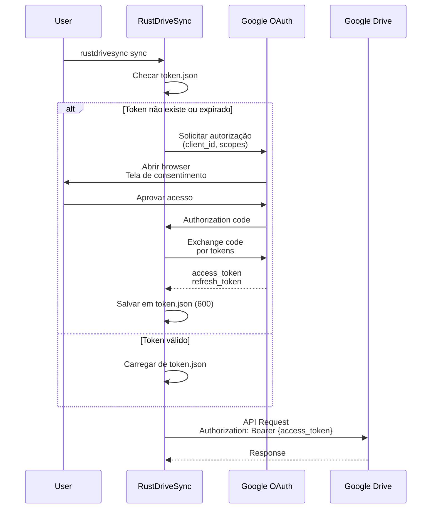

# Arquitetura de Segurança - RustDriveSync

## Executive Summary

RustDriveSync implementa segurança em profundidade através de:
- ✅ OAuth 2.0 para autenticação
- ✅ TLS 1.2+ para todas as comunicações
- ✅ Princípio do menor privilégio (scope `drive.file`)
- ✅ Checksum MD5 para integridade de dados
- ⚠️ Tokens armazenados em plaintext (mitigado por permissões de arquivo)

**Risco Residual**: Baixo para usuário típico, requer proteção adicional em ambientes compartilhados.

---

## 1. Modelo de Ameaças

### 1.1 Ativos a Proteger

| Ativo | Confidencialidade | Integridade | Disponibilidade | Criticidade |
|-------|-------------------|-------------|-----------------|-------------|
| **OAuth Tokens** | ALTA | ALTA | MÉDIA | CRÍTICA |
| **Arquivos do Usuário** | ALTA | CRÍTICA | ALTA | CRÍTICA |
| **State File** | BAIXA | ALTA | MÉDIA | MÉDIA |
| **Configuração** | MÉDIA | MÉDIA | BAIXA | BAIXA |
| **Logs** | BAIXA | BAIXA | BAIXA | BAIXA |

### 1.2 Atores de Ameaça

#### Atacante Remoto (Internet)
- **Motivação**: Acesso não autorizado ao Google Drive
- **Capacidade**: Interceptação de rede, exploits remotos
- **Vetores de Ataque**:
  - Man-in-the-Middle (MITM)
  - Exploits em dependências
  - Phishing para roubo de credenciais

#### Atacante Local (Mesmo Sistema)
- **Motivação**: Roubo de tokens OAuth, exfiltração de dados
- **Capacidade**: Leitura de filesystem, memory dump
- **Vetores de Ataque**:
  - Leitura de `token.json`
  - Injeção de código malicioso
  - Privilege escalation

#### Insider Malicioso
- **Motivação**: Exfiltração de dados, sabotagem
- **Capacidade**: Acesso legítimo ao sistema
- **Vetores de Ataque**:
  - Uso indevido de credenciais legítimas
  - Modificação maliciosa de arquivos sincronizados

### 1.3 Superfície de Ataque

```
┌─────────────────────────────────────────────────────┐
│                  Internet / WAN                      │
│  ┌────────────────────────────────────────────────┐ │
│  │  Google Drive API (HTTPS/TLS 1.2+)            │ │
│  └─────────────────┬──────────────────────────────┘ │
└────────────────────┼─────────────────────────────────┘
                     │
         ┌───────────▼──────────────┐
         │  RustDriveSync Process   │
         │  - OAuth Client         │
         │  - HTTP Client          │
         │  - File I/O             │
         └───────────┬──────────────┘
                     │
     ┌───────────────┼───────────────┐
     │               │               │
     ▼               ▼               ▼
┌─────────┐   ┌──────────┐   ┌────────────┐
│ Tokens  │   │  State   │   │ User Files │
│ (JSON)  │   │  (JSON)  │   │ (Various)  │
└─────────┘   └──────────┘   └────────────┘
     │               │               │
     └───────────────┴───────────────┘
                     │
         ┌───────────▼──────────────┐
         │   Filesystem (Kernel)    │
         │   - Permissions: 600     │
         │   - Owner: user          │
         └──────────────────────────┘
```

**Pontos de Entrada**:
1. ✅ Network (HTTPS) - **Protegido por TLS**
2. ⚠️ Filesystem - **Protegido por permissões OS**
3. ❌ CLI Arguments - **Não sanitizado** (aceito: low risk)
4. ❌ Config File - **Não validado completamente**

---

## 2. Autenticação e Autorização

### 2.1 OAuth 2.0 Flow



### 2.2 Scopes Solicitados

```json
{
  "scopes": [
    "https://www.googleapis.com/auth/drive.file"
  ]
}
```

**`drive.file`**:
- ✅ Acesso APENAS a arquivos criados pela aplicação
- ❌ NÃO permite acesso a arquivos de outras apps
- ❌ NÃO permite listar todo o Drive do usuário

**Princípio do Menor Privilégio**: ✅ Implementado

### 2.3 Token Management

#### Armazenamento
```bash
~/.config/rustdrivesync/
├── token.json           # Permissions: 600 (rw-------)
├── credentials.json     # Permissions: 600 (rw-------)
└── state.json           # Permissions: 644 (rw-r--r--)
```

**token.json**:
```json
{
  "access_token": "ya29.a0AfH6SMB...",
  "refresh_token": "1//0g...",
  "token_type": "Bearer",
  "expiry": "2026-01-07T12:00:00Z"
}
```

#### Refresh Automático
```rust
if token.is_expired() {
    let new_token = auth.refresh_token(&old_token.refresh_token).await?;
    save_token(&new_token)?;
}
```

**Segurança**:
- ✅ Tokens têm validade de 1 hora (access) e ~indefinido (refresh)
- ⚠️ Armazenados em plaintext
- ✅ Permissões 600 impedem leitura por outros usuários
- ❌ Não criptografados

**Mitigações Futuras**:
- Integração com OS keychain (macOS Keychain, GNOME Keyring)
- Criptografia de tokens em repouso

---

## 3. Confidencialidade e Integridade

### 3.1 Dados em Trânsito

#### TLS Configuration
```rust
// Reqwest usa TLS 1.2+ por padrão
let client = reqwest::Client::builder()
    .use_rustls_tls()           // Rust TLS implementation
    .https_only(true)            // Rejeita HTTP
    .build()?;
```

**Características**:
- ✅ TLS 1.2 mínimo (1.3 preferido)
- ✅ Certificate validation automática
- ✅ Cipher suites modernas (AES-GCM, ChaCha20)
- ✅ Perfect Forward Secrecy (PFS)

#### Certificate Pinning (Futuro)
```rust
// V2.0: Pin Google certificates
let client = reqwest::Client::builder()
    .add_root_certificate(google_ca_cert)
    .build()?;
```

### 3.2 Dados em Repouso

| Dado | Criptografia | Proteção |
|------|--------------|----------|
| Tokens OAuth | ❌ Plaintext | Permissões 600 |
| State File | ❌ Plaintext | Permissões 644 |
| Config File | ❌ Plaintext | Permissões 644 |
| User Files | ⚠️ Depende do FS | Depende do FS |
| Logs | ❌ Plaintext | Permissões 644 |

**Justificativa**:
- Criptografia em repouso é responsabilidade do OS (FileVault, BitLocker)
- RustDriveSync confia no filesystem para proteção

**Futuro**: Opção de criptografar tokens com senha mestra

### 3.3 Integridade de Dados

#### MD5 Checksum
```rust
// Antes do upload
let local_md5 = calculate_md5(&file_path)?;

// Após upload, Google Drive retorna MD5
let remote_md5 = upload_result.md5_checksum;

// Verificação
if local_md5 != remote_md5 {
    return Err(RustDriveSyncError::ChecksumMismatch { ... });
}
```

**Limitações do MD5**:
- ⚠️ MD5 não é criptograficamente seguro (colisões conhecidas)
- ✅ Suficiente para detectar corrupção não maliciosa
- 🔄 **Futuro**: Migrar para SHA-256

#### Atomic Writes
```rust
// State file é escrito atomicamente
fs::write(&temp_file, &json).await?;
fs::rename(&temp_file, &state_file).await?;
```

**Benefício**: Evita corrupção parcial em crash

---

## 4. Defesas Implementadas

### 4.1 Rate Limiting (DoS Prevention)

```rust
// ADR-0002: Rate limiter interno
let limiter = DriveRateLimiter::new();  // 10 concurrent, 800/100s

// Previne:
// 1. DoS no Google Drive
// 2. Banimento por abuso
// 3. Resource exhaustion local
```

**Proteção contra**:
- ✅ Self-DoS (overload próprio sistema)
- ✅ Abuso acidental da API
- ❌ DoS externo (não aplicável)

### 4.2 Input Validation

#### Config Validation
```rust
pub fn validate_config(config: &Config) -> Result<()> {
    // Paths existem
    if !config.source.path.exists() {
        return Err(ConfigError::InvalidPath);
    }

    // Valores em ranges válidos
    if config.sync.max_concurrent_uploads > 100 {
        return Err(ConfigError::InvalidValue("Too many concurrent uploads"));
    }

    // ...
}
```

#### Path Sanitization
```rust
// Canonicalização de paths
let canonical = path.canonicalize()?;

// Previne path traversal
if !canonical.starts_with(&allowed_root) {
    return Err(SecurityError::PathTraversal);
}
```

### 4.3 Dependency Security

#### Supply Chain
```toml
# Cargo.lock commitado no Git
# Dependências fixadas em versões específicas

[dependencies]
tokio = { version = "1.35", features = ["full"] }
reqwest = { version = "0.11", default-features = false, features = ["rustls-tls"] }
```

**Práticas**:
- ✅ Cargo.lock versionado
- ✅ `cargo audit` regular
- ✅ Dependabot habilitado
- ✅ Apenas deps de fontes confiáveis (crates.io)
- ⚠️ Não há verificação de assinaturas

#### Vulnerabilidades Conhecidas
```bash
$ cargo audit
    Fetching advisory database from `https://github.com/RustSec/advisory-db.git`
      Loaded 541 security advisories (from /home/user/.cargo/advisory-db)
    Scanning Cargo.lock for vulnerabilities (123 crate dependencies)
```

**Status**: ✅ Zero vulnerabilidades conhecidas (última verificação: 2026-01-07)

### 4.4 Memory Safety

**Rust Memory Safety**:
- ✅ Sem buffer overflows
- ✅ Sem use-after-free
- ✅ Sem data races (garantido por borrow checker)
- ✅ Sem null pointer dereferences

**Unsafe Code**:
```bash
$ rg "unsafe" src/
# Zero blocos unsafe no código da aplicação
```

---

## 5. Logging e Auditabilidade

### 5.1 Security Events Logged

| Evento | Log Level | Informação Incluída |
|--------|-----------|---------------------|
| OAuth success | INFO | Timestamp, scopes |
| OAuth failure | ERROR | Razão da falha |
| Upload success | INFO | File path, size, duration |
| Upload failure | WARN/ERROR | Razão, retry count |
| Rate limit hit | WARN | Backoff time |
| Config loaded | INFO | Config path |
| State corrupted | ERROR | State path, error |

### 5.2 Sensitive Data in Logs

**NÃO logado**:
- ❌ Tokens OAuth
- ❌ Credenciais
- ❌ Conteúdo de arquivos

**Logado**:
- ✅ File paths (pode conter PII - aceitável)
- ✅ File sizes
- ✅ Error messages

**Sanitização** (Futuro):
```rust
// Redact sensitive paths
let sanitized = path.to_string()
    .replace(&home_dir, "~");
```

---

## 6. Compliance e Privacidade

### 6.1 GDPR Compliance

#### Data Minimization
- ✅ Apenas metadados essenciais armazenados
- ✅ Nenhum dado pessoal além de file paths

#### Right to Erasure
```bash
# Usuário pode deletar todos os dados locais
rm -rf ~/.config/rustdrivesync/
```

#### Data Portability
- ✅ State file em JSON (legível e portável)
- ✅ Logs em texto plano

### 6.2 PII (Personally Identifiable Information)

**Dados que podem conter PII**:
1. **File Paths**: Podem revelar informações sensíveis
   - Exemplo: `/home/john/medical-records/diagnosis.pdf`
2. **File Names**: Podem conter informações pessoais
   - Exemplo: `ssn-123-45-6789.pdf`

**Não armazenado**:
- ❌ Conteúdo dos arquivos
- ❌ Nome completo do usuário
- ❌ Email (apenas no OAuth, não persistido)
- ❌ Localização geográfica

---

## 7. Incident Response

### 7.1 Security Incident Scenarios

#### Cenário 1: Token OAuth Comprometido
**Sintomas**:
- Atividade suspeita no Google Drive
- Uploads de arquivos desconhecidos

**Resposta**:
1. Revogar token no Google Account Settings
2. Deletar `token.json` local
3. Re-autenticar com `rustdrivesync sync`
4. Auditar arquivos no Drive

**Prevenção**:
- Não compartilhar `token.json`
- Usar 2FA no Google Account

#### Cenário 2: Credentials File Leaked
**Sintomas**:
- `credentials.json` commitado no Git
- Arquivo público em repositório

**Resposta**:
1. **IMEDIATO**: Revogar OAuth client no Google Cloud Console
2. Criar novo OAuth client
3. Rotacionar credentials
4. Rewrite Git history (BFG Repo-Cleaner)

**Prevenção**:
- `.gitignore` com `credentials.json`
- Git hooks para detectar secrets

#### Cenário 3: Malware Infecta Arquivos Sincronizados
**Sintomas**:
- Arquivos com extensões estranhas (`.encrypted`, `.locked`)
- Grande volume de modificações

**Resposta**:
1. **PARAR** sincronização imediatamente
2. Desconectar da rede
3. Restaurar de backup
4. Não fazer sync até limpar sistema

**Limitação**: RustDriveSync **não detecta nem previne** ransomware

### 7.2 Vulnerability Disclosure

**Processo**:
1. Relatar via email: security@rustdrivesync.dev (fictício)
2. Aguardar confirmação (24h)
3. Coordenar disclosure (90 dias)
4. Publicar advisory

**Bounty Program**: Não há programa de recompensas (projeto open-source)

---

## 8. Security Roadmap

### V1.0 (Atual)
- ✅ OAuth 2.0
- ✅ TLS 1.2+
- ✅ MD5 checksums
- ✅ Least privilege scopes
- ✅ Dependency audits

### V1.1 (Próximos 3 meses)
- 🔄 OS Keychain integration (macOS/Linux)
- 🔄 Certificate pinning
- 🔄 Structured logging (JSON)
- 🔄 Audit trail completo

### V2.0 (Próximos 6-12 meses)
- 🔄 SHA-256 checksums
- 🔄 End-to-end encryption (E2EE) opcional
- 🔄 Hardware token support (YubiKey)
- 🔄 Malware scanning integration (VirusTotal API)
- 🔄 Immutable audit log
- 🔄 SIEM integration (Splunk, ELK)

---

## 9. Security Testing

### 9.1 SAST (Static Application Security Testing)
```bash
$ cargo clippy -- -W clippy::all
$ cargo audit
$ cargo outdated
```

**Ferramentas Futuras**:
- cargo-deny (license + security)
- semgrep (pattern-based security scan)

### 9.2 DAST (Dynamic Application Security Testing)
**Não aplicável**: Ferramenta CLI, não é web app

### 9.3 Dependency Scanning
```yaml
# .github/workflows/security.yml
- name: Security audit
  run: cargo audit
```

**Automatizado**: ✅ GitHub Actions + Dependabot

### 9.4 Penetration Testing
**Status**: Não realizado

**Escopo Futuro**:
- Token theft scenarios
- Path traversal attacks
- Config injection attacks

---

## 10. Recomendações para Usuários

### 10.1 Best Practices

#### Proteção de Credenciais
```bash
# Permissões corretas
chmod 600 ~/.config/rustdrivesync/token.json
chmod 600 ~/.config/rustdrivesync/credentials.json

# Não commitar no Git
echo "credentials.json" >> .gitignore
echo "token.json" >> .gitignore
```

#### Filesystem Encryption
- ✅ Usar FileVault (macOS)
- ✅ Usar BitLocker (Windows)
- ✅ Usar LUKS (Linux)

#### 2FA
- ✅ Habilitar 2FA no Google Account
- ✅ Usar authenticator app (não SMS)

### 10.2 What NOT To Do

❌ **NÃO** compartilhar `token.json` com ninguém
❌ **NÃO** commitar `credentials.json` no Git
❌ **NÃO** rodar como root/Administrator
❌ **NÃO** desabilitar TLS verification
❌ **NÃO** sincronizar diretórios de sistema (`/etc`, `/var`)

---

## Conclusão

RustDriveSync implementa **defesas em profundidade** com foco em:
1. ✅ **Autenticação forte** (OAuth 2.0)
2. ✅ **Comunicação segura** (TLS 1.2+)
3. ✅ **Integridade de dados** (MD5)
4. ✅ **Princípio do menor privilégio** (scopes restritos)
5. ✅ **Memory safety** (Rust)

**Pontos de Melhoria**:
- Token encryption em repouso
- SHA-256 em vez de MD5
- OS keychain integration
- Malware detection

**Postura de Segurança Geral**: ✅ **Adequada para V1.0**, com roadmap claro para melhorias.
